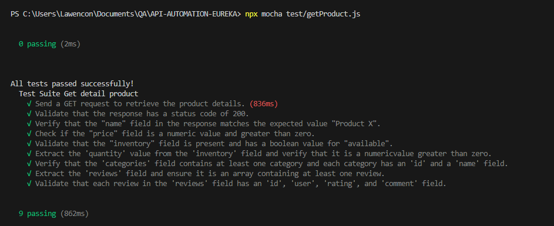

--How to running this API automation
1. open terminal
2. clone repository
3. npm init
4. npm install mocha chai supertest --save-dev
5. npx mocha test/getProduct.js

Hasil general assesment
https://docs.google.com/document/d/17fT4mrTAOGsTr56cquSC6Kwr2YeIn1TS6-ulYT0IRbM/edit?usp=sharing 

